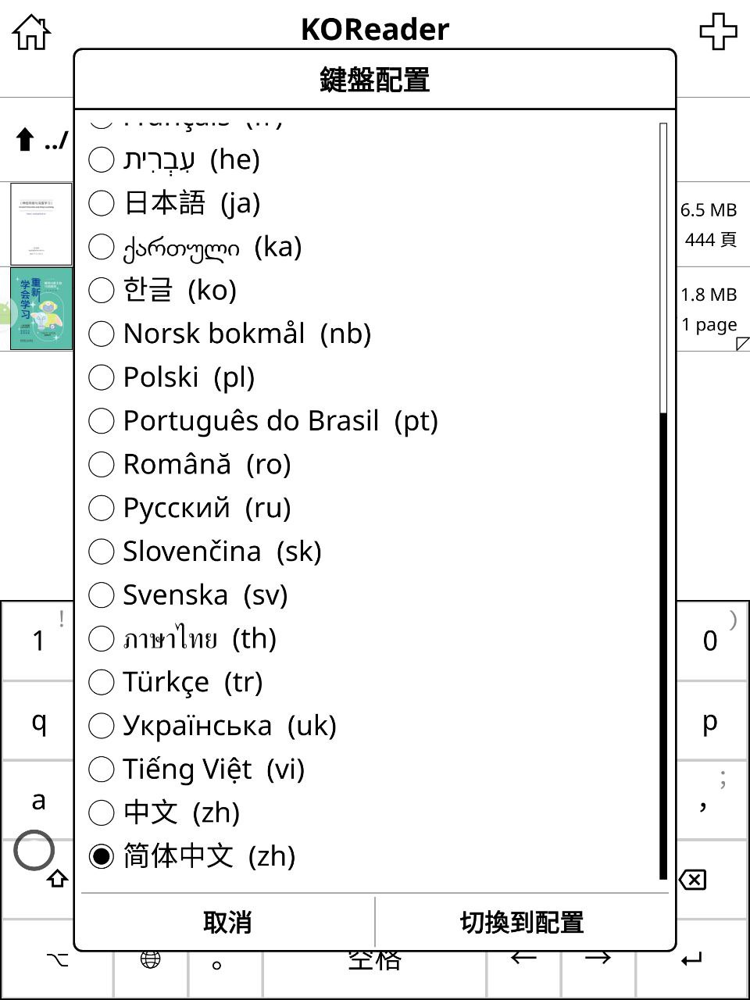
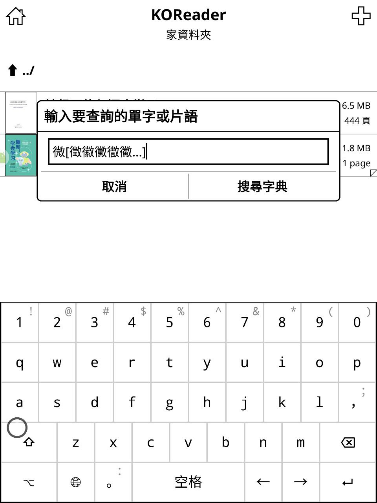

# koreader-boshiamy
一個 koreader 補丁 用於替換原本 拼音 ( zh_pinyin_data.lua ) 成嘸蝦米 ( 此方法也適用於 倉頡/五筆 )

# 使用方法
- 把 **1-replace-zh-pinyin-data.lua** 放到 **koreader/patches/** 目錄下
- **重啟 KOReader**
- 切換鍵盤配置 **簡體中文(zh)** 輸入測試

<table><tbody><tr><td></td></tr></tbody></table>
<table><tbody><tr><td></td></tr></tbody></table>

```
-- 自訂資料
local new_data = [[
return {
    -- 修改對應表內容 
    -- 例如：
    ba={"吧","把","八","爸"},
    bai={"白","百","擺","拜"},
}
]]

local fn = "frontend/ui/data/keyboardlayouts/zh_pinyin_data.lua"
local fp = io.open(fn, "w+")
if fp then
    fp:write(new_data)
    fp:close()
end
```
